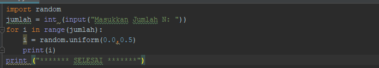
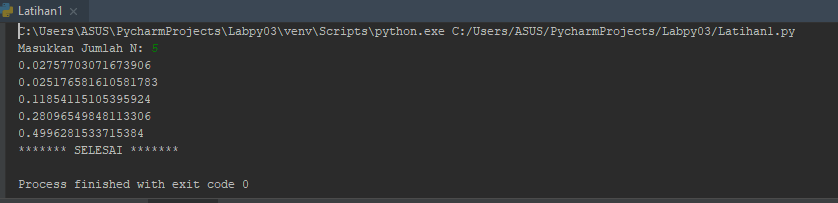
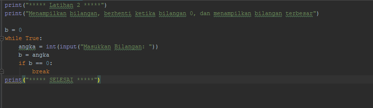
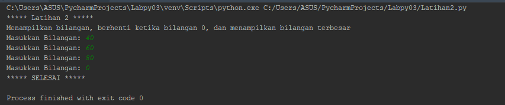
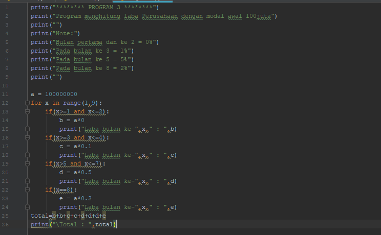
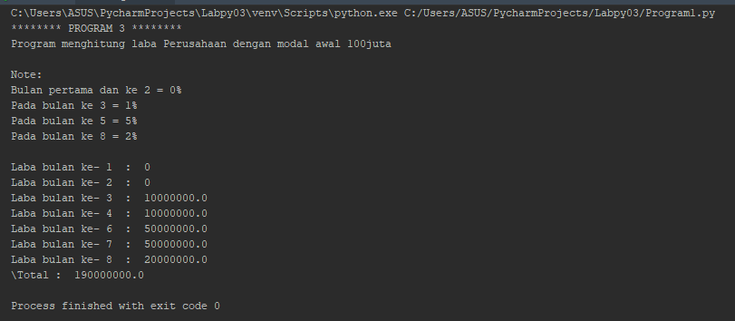

# labpy03

# LATIHAN1

* Tampilkan n bilangan acak yang nilainya lebih dari 0.5
* Nilai n pada saat di runfile
* Anda bisa menggunakan kombinasi while dan for untuk menyelesaikannya

# Contoh Outputnya
#  <h2>

# Tampilan ketika sudah di Run dan memasukkan jumlah N
#  <h2>

# LATIHAN2
Program untuk menampilkan bilangan terbesar dari n buah data yang diinputkan. Dan Memasukan angka 0 untuk berhenti

# Contoh Outputnya
#  <h2>

# Tampilan ketika sudah di Runfile
#  <h2>

# Program1.py
Seorang pengusaha menginvestasikan uangnya untuk memulai usahanya dengan modal awal 100 juta, pada bulan pertama dan kedua belum mendapatkan laba, pada bulan ketiga baru mulai 
mendapatkan laba sebesar 1% dan pada bulan kelima, pendapatan meningkat 5%, selanjutnya pada bulan ke8 mengalami penurunan keuntungan sebesar 2%, sehingga laba menjadi 3%.

# Tampilan Output dan cara menghitung total keuntungan selama 8 bulan hasil usaha
#  <h2>

# Tampilan setelah di Runfile dan Hasil keuntutungan usaha 8 bulan
#  <h2>

